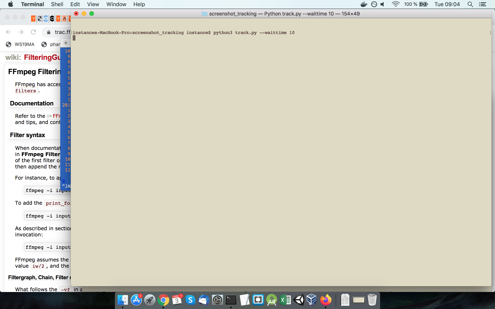
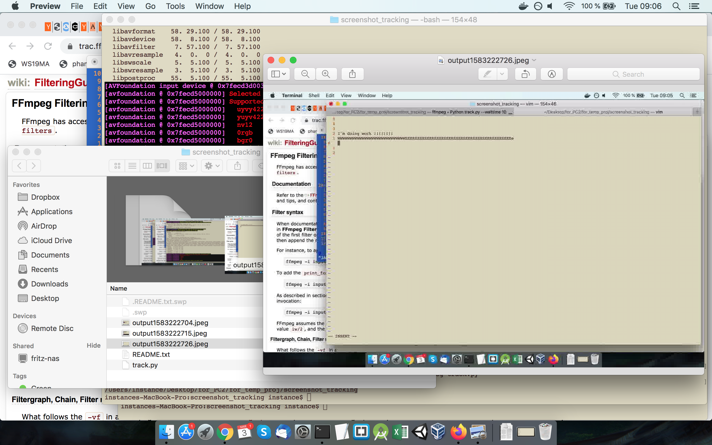

# Simple Mac Screenshot Tracker

<p float="left">
  
   
</p>

Take a screenshot every 60 seconds in low quality (but still enough to see what you were doing at the time).
You are later able to watch what you worked on while the tracker was running.

Dependencies:
* ffmpeg (e.g. `brew install ffmpeg`)

Usage:
```
python3 track.py track
python3 track.py watch
```

For scrolling through all captured screenshots I use: https://github.com/torum/Image-viewer

TODO:
* Support for Linux, Windows. Should be trivial with ffmpeg, simply change the -f parameter (https://trac.ffmpeg.org/wiki/Capture/Desktop). Pull requests are welcome.
* More options, flesh it out. This is more for hackers who want to tinker with it.
* Statistics based on the application in the foreground.
